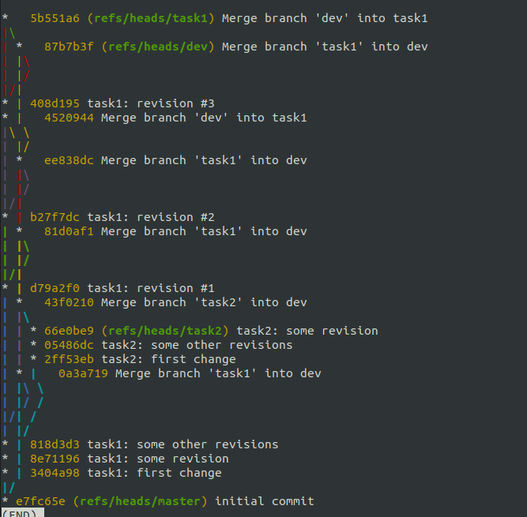
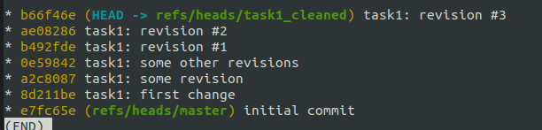

# Git Branch Cleaner

(Experiment)

## create_git_crap.sh <directory_to_be_created>
It creates a git crap with bad commit history in the specified directory.

## cleanup_branch.sh <repository_dir> <branch_to_be_cleaned_up>
Simply it follows the commit chain in the branch and apply them into another fresh branch created from merge base of the branch to be cleaned up.

### Before:

### After:
 
